# DATA266 Lab 1 — Team 33 Report (Tejas's version)

- **Repository:** <https://github.com/SawantTej2912/DATA266_Lab>
- **Members:** Tejas Nandkishor Sawant (`*/tejas/`), Shriram Dundigalla (`*/shriram_dundigalla/`)
- **Kaggle team:** `PairProgramming_Team_33`

All numbers in this report are taken from the repository file cited with each table. Values marked "(derived)" are simple arithmetic on cited values. Confidence intervals are written as [low, high].

## Ownership statement

Each member designed, trained and evaluated his own models for all three tasks, and no model was shared or trained jointly. Before training we agreed on a shared measurement protocol (`TEAM_PROTOCOL.md`, drafted by Shriram and agreed by both). Tejas built a character-level GPT (6 layers, 6 heads, 384-d, 256-character context) for Task 1; an n-gram bag, a Transformer encoder and a BiGRU with attention for Task 2; and a ResNet-9 CycleGAN (run `i270k`) for Task 3. Shriram built a character-level GPT (6 layers, 8 heads, 256-d, 128-character context) for Task 1; a bag-of-embeddings MLP, a BiLSTM and a TextCNN for Task 2; and a U-Net CycleGAN (run 1, epoch 61) for Task 3. He also wrote the shared tooling in `scripts/`. Both members submitted to Kaggle as one team, `PairProgramming_Team_33`. Tejas's Task 3 audit was scored by two raters (Rater 1: Tejas Nandkishor Sawant; Rater 2: Shriram Dundigalla); the audit of Shriram's outputs is pending.

## Summary of results

| Task | Tejas: best model, headline metric | Shriram: best model, headline metric | Team best |
|---|---|---|---|
| 1. Character-level GPT | GPT 6L/6H/384d: val perplexity 1.7482, 0.8059 bits/char | GPT 6L/8H/256d: val perplexity 2.1045, 1.0735 bits/char | Tejas (perplexity 1.7482) |
| 2. Yelp sentiment | BiGRU + attention: test accuracy 0.9536, MCC 0.9073 | TextCNN: test accuracy 0.9344, MCC 0.8688 | Tejas (accuracy 0.9536) |
| 3. CycleGAN | ResNet-9 (`i270k`): submitted FID 98.70, Kaggle score −49.55 | U-Net (run 1): submitted FID 101.44, Kaggle score −50.93 | Tejas (FID 98.70; team rank 20) |

Tejas's models lead on every headline metric, although training data, context length and training budget also differ between members (values from each member's `metrics_report.csv`; Shriram's Kaggle score from his Task 3 notebook).

### Comparability notes

Some choices differ from `TEAM_PROTOCOL.md`. They affect how the side-by-side tables should be read.

| Task | Protocol | What was done | Source |
|---|---|---|---|
| 1 | 100K / 10K windows, shared `metrics.py`, 400-character probe at T in {0, 0.5, 0.8, 1.0, 1.2} | Shriram followed the protocol. Tejas used 100K / 10K stories (about 5 times the text), his own metric code, a 300-character probe with greedy and T = 0.8 only, and distinct-n pooled over 45 samples | `task1_llm/tejas/src/task1_llm.ipynb` (CFG cell), `task1_llm/shriram_dundigalla/src/config.yaml` |
| 2 | Balanced 100K training subsample, 2,000 bootstrap replicates, shared slices | Shriram followed the protocol. Tejas used the full 560K training split (5% held out for validation), 1,000 bootstrap replicates and his own slices (contrast, negation, length quartile, truncated) | `task2_sentiment/tejas/metrics_report.csv`, `task2_sentiment/tejas/src/task2_sentiment.ipynb`, `task2_sentiment/shriram_dundigalla/src/config.yaml` |
| 3 | LPIPS over random generated pairs (diversity) | Both members report LPIPS between each input and its translation, so the two members are comparable with each other but not with the protocol definition | `task3_gan/tejas/evaluate_local.py`, `task3_gan/shriram_dundigalla/results.md` |
| All | Same hardware not required | Tejas used an RTX 4090 for all tasks. Shriram used an Apple M4 (MPS) for Tasks 1 and 2 and a Colab A100 for Task 3. Time, throughput and memory are not directly comparable across members | each `metrics_report.csv` |

---

## Task 1: GPT from scratch (TinyStories, character level)

### Comparison table

| | **Tejas** (`t1_gpt_tejas`) | **Shriram** (`gpt_char_tinystories_v1`) |
|---|---|---|
| Architecture | Decoder-only GPT, 6 pre-LN blocks, 6 heads, d_model 384, FFN 4x GELU, learned token and position embeddings, LM head tied to token embedding | Decoder-only GPT, 6 pre-LN blocks, 8 heads, d_model 256, d_ff 1024, learned token and position embeddings, untied LM head |
| Context length | 256 characters | 128 characters |
| Vocabulary | 77 symbols (characters seen fewer than 50 times mapped to one symbol) | 98 symbols (index 0 = `<unk>`) |
| Data | 100,000 train / 10,000 val stories, seed 1446 | 100,000 train / 10,000 val windows from 20,000 stories (split by story), seed 9015 |
| Dropout | 0.1 | 0.1 |
| Optimiser | AdamW (0.9, 0.95), weight decay 0.1 on weight matrices, clip 1.0 | AdamW (0.9, 0.95), weight decay 0.1 on matmuls only, clip 1.0 |
| LR schedule | peak 6e-4, 3% linear warm-up, cosine to 6e-5 | peak 3e-4, 3% linear warm-up (281 of 9,372 steps), cosine to 0.1x |
| Batch / epochs | 64 x 256 characters, 10 epochs (54,850 steps), fp16 AMP | 128 x 128 characters, 12 epochs (9,372 steps), fp32 |
| Parameters | 10,775,424 | 4,822,016 |
| Train CE (nats/char) | 0.5370 | 0.7089 |
| **Val CE (nats/char)** | **0.5586** | **0.7441** |
| Val perplexity | 1.7482 | 2.1045 (train 2.0317) |
| Val bits/char | 0.8059 | 1.0735 (train 1.0227) |
| Generalization gap (val CE minus train CE) | 0.0216 | 0.0352 |
| Top-1 next-character accuracy (val) | 0.8212 (train 0.8267) | 0.7639 (train 0.7728) |
| Best epoch | 10 of 10 (val still falling) | 12 of 12 (val still falling) |
| Distinct-1 / 2 / 3 (word level, T = 0.8) | 0.2727 / 0.6934 / 0.8901, pooled over 45 continuations | single draw 0.7073 / 0.9877 / 1.0000; mean ± SD over 15 draws 0.714 ± 0.046 / 0.957 ± 0.030 / 0.991 ± 0.014 |
| Repeated 4-gram rate (T = 0.8) | 0.0036 | single draw 0.0000; 15 draws 0.0017 ± 0.0044 |
| Greedy: distinct-2 / repeated 4-gram | 0.6278 / 0.0804 | 0.690 ± 0.311 / 0.235 ± 0.319 (15 draws) |
| Best decoding strategy | not evaluated (greedy and T = 0.8 only) | repetition penalty 1.15 (repeated 4-gram 0.000 ± 0.000) |
| Gradient norm mean / max | 0.280 / 16.77 (max at step 0) | 0.701 / 11.13 (max at step 0) |
| NaN / non-finite | 18 fp16 overflow steps skipped by GradScaler, 0 NaN losses | 0 |
| Loss spikes | 0 | 0 |
| Train throughput | 357,646 tokens/s | 24,990 tokens/s |
| Generation throughput | 256.7 tokens/s (no KV cache) | 371.8 tokens/s |
| Peak memory | 3,324 MB (CUDA) | 80.0 MB (MPS allocator) |
| Training time | 45.4 min compute (47.4 min wall) | 6,144 s (102.4 min) |
| Hardware | RTX 4090 + Ryzen 9 7950X | Apple M4 (MPS) |

Sources: `task1_llm/tejas/metrics_report.csv`, `task1_llm/tejas/outputs/epoch_history.csv`, `task1_llm/tejas/results.md`; `task1_llm/shriram_dundigalla/metrics_report.csv`, `task1_llm/shriram_dundigalla/results.md` (15-draw sweep and decoding tables), `task1_llm/shriram_dundigalla/src/config.yaml`.

Shriram's generation throughput is taken from his `metrics_report.csv`; his `results.md` lists 387 tokens/s.

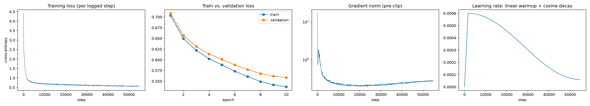
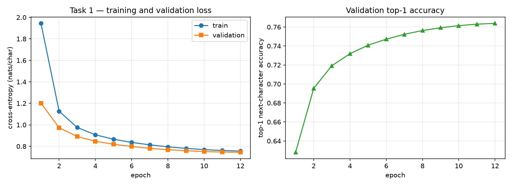

*Left: Tejas, training loss, train and val loss per epoch, gradient norm and LR. Right: Shriram, train and val loss curves.*

### Joint analysis

**Strengths.** Tejas's model has the lower validation CE (0.5586 vs. 0.7441) and the higher top-1 accuracy (0.821 vs. 0.764). Both runs were stable, with 0 loss spikes and the maximum gradient norm at step 0. Tejas's 18 non-finite steps are fp16 overflows (0.03% of steps), not divergence. Both generalization gaps are small (0.0216 and 0.0352). Sampling at T = 0.8 removes most of the greedy repetition, and Shriram showed that a repetition penalty of 1.15 removes repeated 4-grams entirely.

**Weaknesses.** Greedy decoding loops for both models (repeated 4-gram rate 0.080 for Tejas, 0.235 ± 0.319 for Shriram). Both failure analyses trace story resets to the context window (128 characters for Shriram; 256 characters, shorter than the 300-character generations, for Tejas). Both models still underfit: validation loss was still falling in the last epoch (Tejas by 0.0035 in epoch 10, Shriram by 0.0032 in epoch 12, derived from the epoch logs).

**Limitations.** The two models differ in size (10.78M vs. 4.82M parameters), context (256 vs. 128 characters), training text (about 5 times more for Tejas) and vocabulary (77 vs. 98 symbols), so the perplexity gap cannot be assigned to a single factor. Absolute distinct-n values are not comparable, because Tejas pools n-grams over 45 continuations and Shriram averages over 15 draws. Throughput and memory differences mostly reflect the hardware (RTX 4090 vs. Apple M4).

**Next steps.** Train both models for more epochs or with more capacity. Try a longer context or subword tokens, add a KV cache, use a repetition penalty for both models, and rerun both on matched data.

### Evidence

| | Tejas | Shriram |
|---|---|---|
| Loss curves | [`loss_curves.png`](../task1_llm/tejas/outputs/loss_curves.png) | [`loss_curves_…png`](../task1_llm/shriram_dundigalla/outputs/loss_curves_gpt_char_tinystories_v1_20260928T204206Z.png), [`stability_…png`](../task1_llm/shriram_dundigalla/outputs/stability_gpt_char_tinystories_v1_20260928T204206Z.png) |
| Raw log | [`t1_gpt_tejas_20261001-144225.jsonl`](../reproducibility/raw_logs/task1_llm/tejas/t1_gpt_tejas_20261001-144225.jsonl) | [`task1_gpt_char_tinystories_v1_20260928T204206Z.log`](../reproducibility/raw_logs/task1_gpt_char_tinystories_v1_20260928T204206Z.log) |
| Generations | [`generations.json`](../task1_llm/tejas/outputs/generations.json), [`diversity_samples.json`](../task1_llm/tejas/outputs/diversity_samples.json), [`failure_candidates.json`](../task1_llm/tejas/outputs/failure_candidates.json) | [`generations_…txt`](../task1_llm/shriram_dundigalla/outputs/generations_gpt_char_tinystories_v1_20260928T204206Z.txt), [`generation_sweep_…csv`](../task1_llm/shriram_dundigalla/outputs/generation_sweep_gpt_char_tinystories_v1_20260928T204206Z.csv), [`decoding_comparison_…csv`](../task1_llm/shriram_dundigalla/outputs/decoding_comparison_gpt_char_tinystories_v1_20260928T204206Z.csv) |
| Checkpoint | [`best.pt`](../task1_llm/tejas/checkpoints/best.pt) (epoch 10) | [`gpt_char_tinystories_v1_20260928T204206Z.pt`](../task1_llm/shriram_dundigalla/checkpoints/gpt_char_tinystories_v1_20260928T204206Z.pt) |
| Manifest | [`manifest_t1_gpt_tejas.json`](../reproducibility/manifests/task1_llm/tejas/manifest_t1_gpt_tejas.json) | [`shriram_dundigalla_manifest.md`](../reproducibility/manifests/shriram_dundigalla_manifest.md) |

---

## Task 2: Yelp Polarity sentiment classification

All six models are scored on the full official test set of 38,000 reviews (19,000 per class) at threshold 0.5. No pretrained embeddings are used.

### Comparison table

| | **T-Base** n-gram bag | **T-Exp1** Transformer | **T-Exp2** BiGRU + attention | **S-Base** bag of embeddings | **S-Exp1** BiLSTM | **S-Exp2** TextCNN |
|---|---|---|---|---|---|---|
| Member | Tejas | Tejas | Tejas | Shriram | Shriram | Shriram |
| Architecture | mean of unigram and hashed-bigram embeddings, linear output (200K buckets) | 2 layers, 4 heads, d 128, FFN 256, learned positions, pre-LN, masked mean pool | BiGRU hidden 128 with attention pooling | mean-pooled embeddings, MLP [256], 1 logit | BiLSTM hidden 192, [mean; max] pool, 1 logit | Conv1d widths 2/3/4/5 with 128 filters, global max pool, 1 logit |
| Embedding dim | 64 | 128 | 128 | 128 | 200 | 160 |
| Dropout / LR / batch | 0.2 / 2e-3 / 256 | 0.1 / 5e-4 / 128 | 0.3 / 1e-3 / 128 | 0.3 / 1e-3 / 256 | 0.4 / 1e-3 / 128 | 0.5 / 1.5e-3 / 256 |
| Epochs (max / run) | 5 / 5 | 5 / 5 | 5 / 5 | 6 / 3 | 5 / 5 | 6 / 4 |
| Optimiser | Adam, clip 5.0, early stopping (patience 2) | same | same | AdamW wd 1e-4, clip 1.0, early stopping (patience 2) | same | same |
| Preprocessing | lemmatize, keep negations, vocab 45,818 (min_freq 5), max_len 188, head and tail truncation | same | same | Porter stem, keep negations, vocab 30,000 (min_freq 2), max_len 250 | same | same |
| Training data | full 560K (5% val) | same | same | balanced 100K + 10K val | same | same |
| **Accuracy [95% CI]** | 0.9327 [0.9301, 0.9351] | 0.9365 [0.9341, 0.9388] | **0.9536 [0.9514, 0.9557]** | 0.9245 [0.9218, 0.9272] | 0.9334 [0.9309, 0.9358] | 0.9344 [0.9319, 0.9368] |
| Macro P / R / F1 | 0.9327 / 0.9327 / 0.9327 | 0.9365 / 0.9365 / 0.9365 | 0.9536 / 0.9536 / 0.9536 | 0.9247 / 0.9245 / 0.9245 | 0.9337 / 0.9334 / 0.9334 | 0.9344 / 0.9344 / 0.9344 |
| Macro-F1 95% CI | [0.9301, 0.9351] | [0.9341, 0.9388] | [0.9514, 0.9557] | [0.9218, 0.9271] | [0.9309, 0.9358] | [0.9319, 0.9368] |
| Micro P / R / F1 | 0.9327 | 0.9365 | 0.9536 | 0.9245 | 0.9334 | 0.9344 |
| Weighted P / R / F1 | 0.9327 / 0.9327 / 0.9327 | 0.9365 / 0.9365 / 0.9365 | 0.9536 / 0.9536 / 0.9536 | 0.9247 / 0.9245 / 0.9245 | 0.9337 / 0.9334 / 0.9334 | 0.9344 / 0.9344 / 0.9344 |
| Confusion TN / FP / FN / TP | 17,786 / 1,214 / 1,345 / 17,655 | 17,902 / 1,098 / 1,316 / 17,684 | 18,143 / 857 / 905 / 18,095 | 17,756 / 1,244 / 1,625 / 17,375 | 17,498 / 1,502 / 1,028 / 17,972 | 17,759 / 1,241 / 1,251 / 17,749 |
| ROC-AUC | 0.9794 | 0.9843 | **0.9906** | 0.9751 | 0.9830 | 0.9829 |
| PR-AUC | 0.9788 | 0.9847 | **0.9909** | 0.9748 | 0.9836 | 0.9835 |
| **MCC [95% CI]** | 0.8653 [0.8603, 0.8703] | 0.8730 [0.8683, 0.8777] | **0.9073 [0.9028, 0.9114]** | 0.8492 [0.8438, 0.8545] | 0.8671 [0.8622, 0.8719] | 0.8688 [0.8638, 0.8737] |
| Brier | 0.0507 | 0.0477 | **0.0356** | 0.0572 | 0.0500 | 0.0487 |
| ECE, predicted-class confidence (15 bins) | 0.0072 | 0.0121 | 0.0120 | **0.0044** | 0.0165 | 0.0061 |
| ECE, positive class | not computed | not computed | not computed | 0.0075 | 0.0203 | 0.0064 |
| McNemar vs. own baseline (b / c, χ², p) | reference | 766 / 911, 12.36, 4.4e-4 | 561 / 1,358, 330.18, 8.8e-74 | reference | 976 / 1,315, 49.87, 1.6e-12 | 932 / 1,309, 63.09, 2.0e-15 |
| Best val macro-F1 | 0.9312 | 0.9348 | 0.9527 | 0.9214 | 0.9330 | 0.9351 |
| Parameters | 15,732,417 | 6,154,113 | 6,063,362 | 3,873,281 | 6,605,953 | 5,087,745 |
| Training time | 0.55 min | 2.97 min | 11.99 min | 25.8 s | 2,318.6 s | 211.1 s |
| Examples / s | 80,405 | 14,950 | 3,698 | 11,610 | 216 | 1,895 |
| Peak memory | 355 MB (CUDA) | 947 MB (CUDA) | 440 MB (CUDA) | 60 MB (MPS) | 102 MB (MPS) | 79 MB (MPS) |
| Hardware | RTX 4090 | RTX 4090 | RTX 4090 | Apple M4 | Apple M4 | Apple M4 |
| Bootstrap replicates | 1,000 | 1,000 | 1,000 | 2,000 | 2,000 | 2,000 |

McNemar b = baseline right and experimental model wrong; c = baseline wrong and experimental model right. Shriram also reports BiLSTM vs. TextCNN: 931 / 969, p = 0.396 (`task2_sentiment/shriram_dundigalla/results.md`).

Sources: `task2_sentiment/tejas/metrics_report.csv`, `task2_sentiment/tejas/outputs/table_*.csv`, `task2_sentiment/tejas/results.md`; `task2_sentiment/shriram_dundigalla/metrics_report.csv`, `task2_sentiment/shriram_dundigalla/outputs/mcnemar_tests.csv`, `task2_sentiment/shriram_dundigalla/src/config.yaml`, `task2_sentiment/shriram_dundigalla/results.md`.

### Weakest data slice per model

| Model | Weakest slice (n) | Macro-F1 | Error rate | Note |
|---|---|---|---|---|
| T-Base n-gram bag | `truncated = True` (1,843) | 0.9111 | 0.0787 | also lowest macro-F1 |
| T-Exp1 Transformer | `truncated = True` (1,843) | 0.9219 | 0.0695 | also lowest macro-F1 |
| T-Exp2 BiGRU | `truncated = True` (1,843) | 0.9294 | 0.0624 | also lowest macro-F1 |
| S-Base BoW | `exclamations = no_exclaim` (20,364) | 0.9120 | 0.0854 | also lowest macro-F1 |
| S-Exp1 BiLSTM | `exclamations = no_exclaim` (20,364) | 0.9206 | 0.0776 | lowest macro-F1 is `no_negation` (0.9185) |
| S-Exp2 TextCNN | `exclamations = no_exclaim` (20,364) | 0.9229 | 0.0750 | lowest macro-F1 is `no_negation` (0.9207) |

Sources: `task2_sentiment/tejas/outputs/table_slices.csv`, `task2_sentiment/shriram_dundigalla/outputs/slice_metrics.csv`. The two members use different slice definitions, so slices are compared within a member only. For Tejas's BiGRU the truncated-slice error rate (0.0624) is about 1.3 times its overall error rate (0.0464, derived).

### Joint analysis

**Model families.** Tejas's n-gram bag beats Shriram's bag of embeddings (0.9327 vs. 0.9245); the hashed bigrams are a likely reason, but this is confounded with about 5 times more training data. Among order-aware models the BiGRU (0.9536) is ahead of the Transformer (0.9365), the TextCNN (0.9344) and the BiLSTM (0.9334).

**Within each member.** Both of Tejas's experimental models beat his baseline significantly, the BiGRU by a large margin (p = 8.8e-74) and the Transformer by a small one (p = 4.4e-4). Shriram's BiLSTM and TextCNN are statistically tied (p = 0.396), and both beat his baseline by about 1 point. Across both members, order-aware models add 1 to 2 points over a bag model that already reaches 92 to 93%.

**Cost.** The BiGRU is Tejas's slowest model (3,698 vs. 80,405 examples/s for the n-gram bag) and gains 2.1 accuracy points. Shriram's TextCNN matches his BiLSTM at 11 times the speed (211 s vs. 2,319 s). Parameter counts are dominated by embedding tables for both members. Cost is not comparable across members because the hardware differs.

**Calibration.** All models are well calibrated (confidence ECE at most 0.0165). For both members the bag baseline has the lowest ECE (0.0072 and 0.0044), so the most accurate model is not the best calibrated.

**Slices.** Truncated reviews (more than 188 tokens) are the weakest slice for all of Tejas's models. Reviews without exclamation marks are the weakest slice for all of Shriram's models. Both members found that negation is not where errors concentrate once negation words are kept: Tejas's BiGRU has only 0.3 points more error on negation reviews, and Shriram's models score higher macro-F1 on them.

**Shared errors.** The two independent 20-error reviews flagged some of the same test reviews as probable label noise ("Wow love the place…", "my husband had an omelette…") and the same edited review ("EDIT: They really did change the service…"). This supports a label-noise floor under both error rates.

**Strengths.** Tejas's BiGRU with attention is the best model on every headline metric (accuracy 0.9536, MCC 0.9073, ROC-AUC 0.9906, Brier 0.0356), and its accuracy CI does not overlap any other model's. Every experimental model beats its member's baseline significantly. Shriram's TextCNN matches his BiLSTM at 11 times the speed.

**Weaknesses.** Long reviews are the BiGRU's main weakness: its error rate on the truncated slice is 0.0624, against 0.0464 overall. Shriram's models are weakest on reviews without exclamation marks (TextCNN error rate 0.0750 on that slice). Shriram's BiLSTM has the highest ECE (0.0165), which matches its rising validation loss. Part of the remaining error is sarcasm, mixed reviews and label noise, which neither member expects modelling to fix.

**Limitations.** One seed per model. Tejas trained on all 560K reviews while Shriram used a balanced 100K subsample, so part of the BiGRU's lead may come from data size; a rerun on matched data is needed before calling it an architectural win. Slice definitions, truncation lengths (188 vs. 250 tokens) and bootstrap counts (1,000 vs. 2,000) also differ across members.

**Next steps.** Retrain each member's best architecture on the same data, run a seed sweep (`scripts/seed_sweep_task2.py`), test Tejas's max_len 188 to 400 change, test Shriram's position-aware pooling and negation-scope marking, and apply temperature scaling to the BiLSTM.

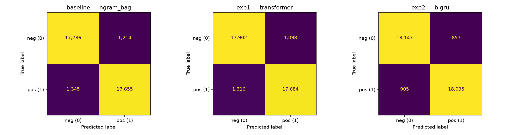
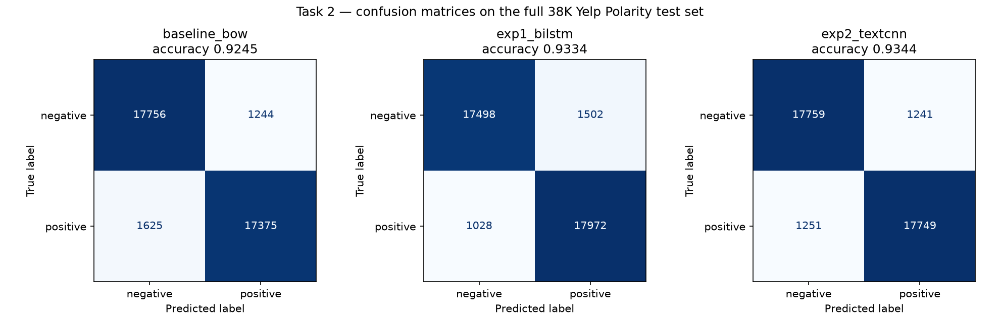

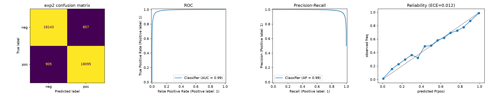
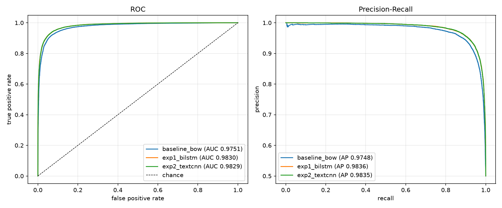

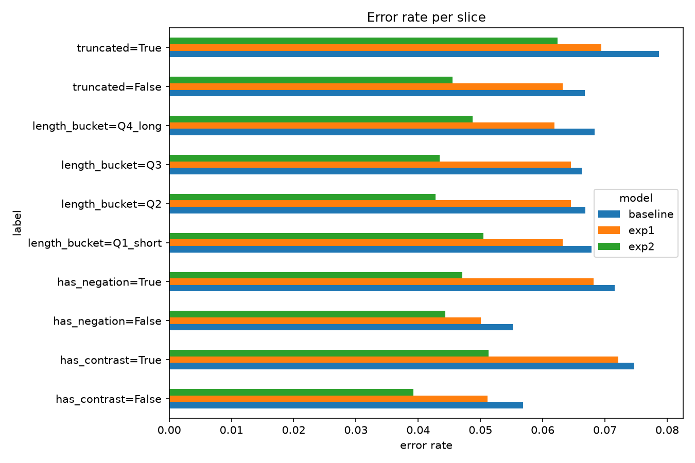
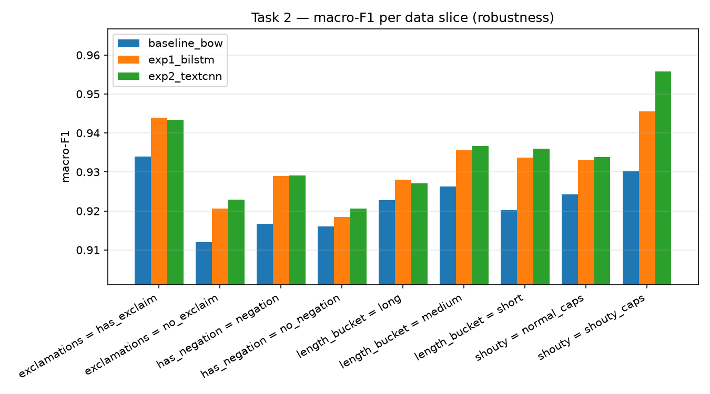

*Left column: Tejas (confusion matrices, BiGRU ROC/PR/reliability, slice error rates). Right column: Shriram (confusion matrices, ROC/PR curves, slice macro-F1).*

### Evidence

| | Tejas | Shriram |
|---|---|---|
| Confusion matrices | [`confusion_matrices_all.png`](../task2_sentiment/tejas/outputs/confusion_matrices_all.png) | [`confusion_matrices.png`](../task2_sentiment/shriram_dundigalla/outputs/figures/confusion_matrices.png) |
| ROC / PR / reliability | [`baseline_eval_plots.png`](../task2_sentiment/tejas/outputs/baseline_eval_plots.png), [`exp1_eval_plots.png`](../task2_sentiment/tejas/outputs/exp1_eval_plots.png), [`exp2_eval_plots.png`](../task2_sentiment/tejas/outputs/exp2_eval_plots.png) | [`roc_pr_curves.png`](../task2_sentiment/shriram_dundigalla/outputs/figures/roc_pr_curves.png), [`calibration.png`](../task2_sentiment/shriram_dundigalla/outputs/figures/calibration.png), [`bootstrap_cis.png`](../task2_sentiment/shriram_dundigalla/outputs/figures/bootstrap_cis.png) |
| Slices | [`slice_error_rates.png`](../task2_sentiment/tejas/outputs/slice_error_rates.png), [`table_slices.csv`](../task2_sentiment/tejas/outputs/table_slices.csv) | [`slice_macro_f1.png`](../task2_sentiment/shriram_dundigalla/outputs/figures/slice_macro_f1.png), [`slice_metrics.csv`](../task2_sentiment/shriram_dundigalla/outputs/slice_metrics.csv) |
| Training curves | [`model_comparison.png`](../task2_sentiment/tejas/outputs/model_comparison.png) | [`training_curves.png`](../task2_sentiment/shriram_dundigalla/outputs/figures/training_curves.png) |
| Raw logs | [`baseline`](../reproducibility/raw_logs/task2_sentiment/tejas/t2_sentiment_tejas_baseline_20261001-154517.jsonl), [`exp1`](../reproducibility/raw_logs/task2_sentiment/tejas/t2_sentiment_tejas_exp1_20261001-154551.jsonl), [`exp2`](../reproducibility/raw_logs/task2_sentiment/tejas/t2_sentiment_tejas_exp2_20261001-154854.jsonl) | [`task2_20260929T033024Z.log`](../reproducibility/raw_logs/task2_20260929T033024Z.log) |
| Checkpoints | `checkpoints/{baseline,exp1,exp2}_best.pt` | `checkpoints/{baseline_bow,exp1_bilstm,exp2_textcnn}.pt` |

---

## Task 3: CycleGAN Monet ↔ Photo

All FID and MiFID values come from the course evaluation script (`task3_gan/Part3_Evaluation_Script.ipynb`, reproduced in each member's `evaluate_local.py`): ImageNet normalisation, Resize(299) and CenterCrop(299), n = 300 per side, and the submitted value is the mean of both directions. A2B is Monet to Photo and B2A is Photo to Monet.

### Comparison table

| | **Tejas**: ResNet-9, run `i270k`, EMA snapshot epoch 280 | **Shriram**: U-Net, run 1, epoch 61 (`ckpt_epoch060.pth`) |
|---|---|---|
| Generator | ResNet-9 (c7s1-64, d128, d256, 9 residual blocks, 2 resize-convolution upsampling layers, c7s1-3, tanh), InstanceNorm, reflection padding | U-Net depth 8, ngf 64: 8 stride-2 encoder blocks, 8 transposed-conv decoder blocks with skip connections, InstanceNorm, dropout 0.5 in the first 3 decoder blocks, tanh |
| Discriminator | 70x70 PatchGAN, ndf 64, InstanceNorm, LeakyReLU 0.2 | 70x70 PatchGAN, ndf 64 (C64-C128-C256-C512), 30x30 output map |
| Parameters | G 11,378,179 each; D 2,764,737 each; 28,285,832 total | G 54,404,099 each; D 2,763,841 each; 114.34M total |
| Losses | LSGAN + cycle L1 (λ 10) + identity L1 (λ_id 5 for Monet to Photo; 5 down to 1.5 for Photo to Monet during the decay phase) | LSGAN + cycle L1 (λ 10) + identity L1 (λ 5) |
| Learning rates | Adam (0.5, 0.999); G 2e-4, D 7.5e-5 | Adam (0.5, 0.999); 2e-4 for G and D |
| Schedule | constant until epoch 135 (45%), then linear decay to 0 | constant for 50 epochs, then linear decay to 0 over 50 |
| Iterations | 900 per epoch x 300 epochs = 270,000 (selected snapshot at 252,000, derived) | 1,000 per epoch x 100 epochs = 100,000 (selected checkpoint at 61,000, derived) |
| Batch / image pool | 1 / 50 | 1 / 50 |
| Augmentation / regularisation | resize 286, random crop 256, horizontal flip; DiffAugment (colour, translation, cutout) on all D inputs; EMA of G weights (0.999) | resize 286, random crop 256, horizontal flip; N(0, 0.02) init; AMP |
| Model selection | EMA snapshots every 10 epochs scored with the course FID | checkpoints at epochs 51 to 100 scored with an earlier A2B-only FID; epoch 61 best |
| Seed / hardware | 1446 / RTX 4090 | 42 / A100 (Colab) |
| **FID A2B / B2A** | 100.92 / **96.49** | 103.92 / 98.95 |
| **FID submitted (mean)** | **98.70** | 101.44 |
| MiFID A2B / B2A / mean | 0.4166 / 0.4045 / 0.4106 | 0.4241 / 0.4104 / 0.4172 |
| KID A2B / B2A | 0.0181 ± 0.0022 / 0.0066 ± 0.0015 | 0.0191 ± 0.0033 / 0.0082 ± 0.0010 |
| Precision / recall A2B | 0.747 / 0.483 | 0.683 / 0.443 |
| Precision / recall B2A | 0.543 / 0.720 | 0.500 / 0.730 |
| Density / coverage A2B | 1.078 / 0.907 | 0.863 / 0.790 |
| Density / coverage B2A | 0.451 / 0.710 | 0.385 / 0.693 |
| Cycle L1 (A→B→A / B→A→B) | 0.0785 / 0.0849 | 0.0471 / 0.0493 |
| LPIPS, input vs. translation, A2B / B2A | 0.322 / 0.364 | 0.181 / 0.250 |
| Content cosine A2B / B2A | 0.812 / 0.796 (Inception-v3) | 0.8259 / 0.7253 (VGG16) |
| Final cycle / identity loss | 0.146 / 0.140 (epoch 300) | 0.0935 / 0.0486 (epoch 100) |
| Final G / D loss | G 2.870; D_A 0.144, D_B 0.184 (epoch 300) | G 2.319; D 0.261 (epoch 100) |
| NaN count | 0 | 0 (all 3 runs) |
| G gradient norm mean / max | 29.5 / 1,017.9 at epoch 3 (D 17.5 / 72.5) | 27.0 / 112.5 |
| Training time | 507.0 min (533.2 min wall) | 2.77 h (99.6 s per epoch) |
| Train images / s | 17.8 | 10.04 |
| Inference images / s A2B / B2A | 270.9 / 360.8 | not measured |
| Peak memory | 3,386 MB (training) | 1,882 MB (inference only; training peak not logged) |
| Kaggle score | −49.55 | −50.93 |
| Kaggle rank | team rank 20 (team best score −49.55) | team rank 20 (team best score −49.55) |
| Human audit (30 samples, 2 raters) | style 4.33 (A2B 4.10 / B2A 4.57), quadratic κ 0.84, 73% agreement; content 4.70 (4.60 / 4.80), κ 1.00, 100%; artifacts in 55% (53% / 57%), κ 0.66, 83% | pending at time of writing (ratings not yet recorded) |

Sources: `task3_gan/tejas/metrics_report.csv`, `task3_gan/tejas/results.md`, `task3_gan/tejas/submission.csv`, `task3_gan/tejas/outputs/{checkpoint_selection,audit_results}.csv`, `reproducibility/manifests/task3_gan/tejas/manifest_t3_cyclegan_tejas.json`; `task3_gan/shriram_dundigalla/{metrics_report,full_metrics_report,submission}.csv`, `task3_gan/shriram_dundigalla/results.md`, and printed outputs of `task3_gan/shriram_dundigalla/src/task3_cyclegan_unet.ipynb` (per-direction cycle L1, content cosine and KID spread, training seconds, Kaggle score).

Shriram's content cosine uses VGG16 features and is not directly comparable to Tejas's Inception-based value. Shriram's final losses are from epoch 100, not from the submitted epoch 61 checkpoint. All epochs in this report are 1-based; Shriram's checkpoint file names are 0-based (`ckpt_epoch060.pth` is epoch 61).

### Run histories

**Tejas** (`task3_gan/tejas/results.md`, `task3_gan/tejas/exploratory/*/metrics_report.csv`, `task3_gan/tejas/outputs/checkpoint_selection.csv`):

| Run | Iterations | Change and reason | Best FID mean (A2B / B2A) | Train time | G grad-norm max | Score |
|---|---|---|---|---|---|---|
| quick30 | 9K (30 x 300) | Baseline: paper configuration, transposed-conv upsampling | 146.97 (142.82 / 151.12) | 23.5 min | 142.7 | −73.70 |
| e200 | 60K (200 x 300) | Resize-convolution (quick30 showed checkerboard artifacts), longer schedule, snapshot selection | 114.23 (122.30 / 106.16) | 102.8 min | 916.1 | −57.33 |
| e300 | 90K (300 x 300) | DiffAugment, slower D (1e-4) and EMA, because the D dominated in e200 (D loss about 0.06, real/fake 0.86/0.14) | 110.70 (115.56 / 105.85) | 168.1 min | 179.6 | −55.56 |
| i180k | 180K (200 x 900) | Same setup, twice as long, because the e300 plateau was the LR reaching 0 | 103.09 (104.70 / 101.48) | 329.5 min | 190.4 | −51.75 |
| **i270k (final)** | **270K (300 x 900)** | Direction-specific identity ramp (Photo to Monet had plateaued near 101), D LR 7.5e-5, 45/55 schedule | **98.70 (100.92 / 96.49)** | 507.0 min | 1,017.9 | **−49.55** |

The score column is −(FID + MiFID)/2. Only i270k has a recorded leaderboard score; the values for the earlier runs come from Tejas's snapshot tables.

**Shriram** (`task3_gan/shriram_dundigalla/results.md`, `failure_analysis.md`, `full_metrics_report.csv`, `src/task3_cyclegan_unet.ipynb`):

| Run | Change | FID mean (A2B / B2A) | G grad-norm mean / max | NaN |
|---|---|---|---|---|
| **1 (submitted)** | Baseline U-Net, λ_cycle 10, λ_id 5, 100 epochs x 1,000 steps; best checkpoint epoch 61 | **101.44** (103.92 / 98.95) | 27.0 / 112.5 | 0 |
| 2 | λ_cycle 8, λ_id 2, 80 epochs, constant LR for 40 epochs then linear decay; best checkpoint epoch 80 | 101.51 (102.65 / 100.37) | not measured | 0 |
| 3 | Run-2 losses plus DiffAugment (colour, translation, cutout) on all D inputs, 80 epochs | 112.97 (108.54 / 117.40) | 137.0 / 640.5 | 0 |

Shriram's run-2 FID is reported from the official script (101.51); his own scoring of the same checkpoint gave 99.58. For run 1 he selected among checkpoints at epochs 51, 61, 71, 81, 91 and 100 with an earlier A2B-only FID (88.02, 87.32, 88.13, 87.59, 87.51, 89.02), which is on a different scale from the course script.

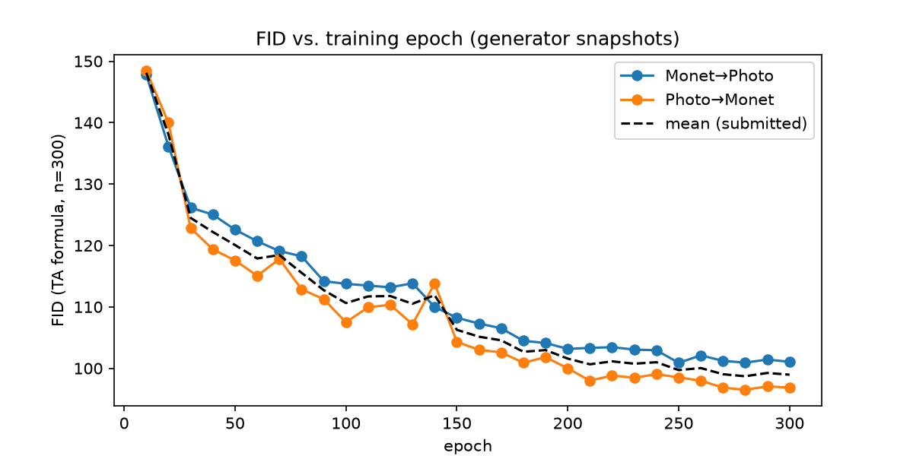
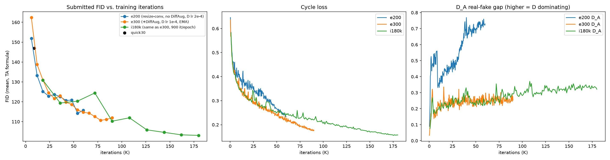

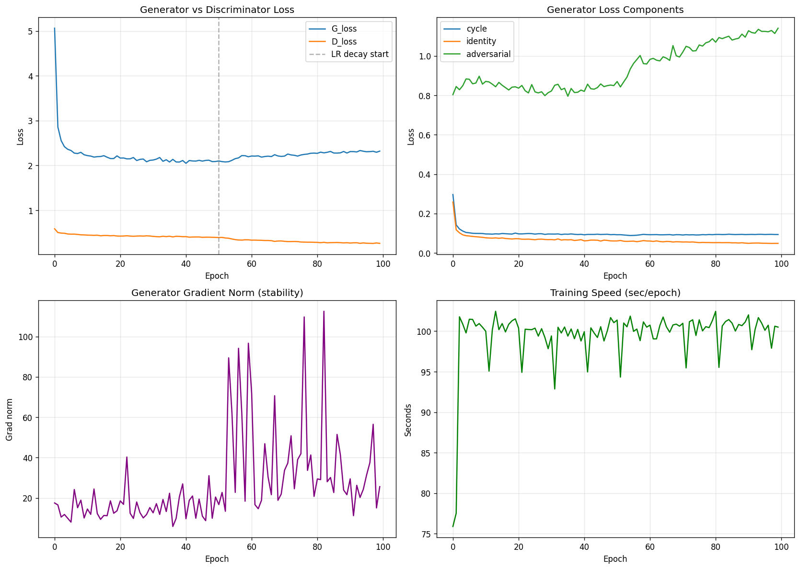
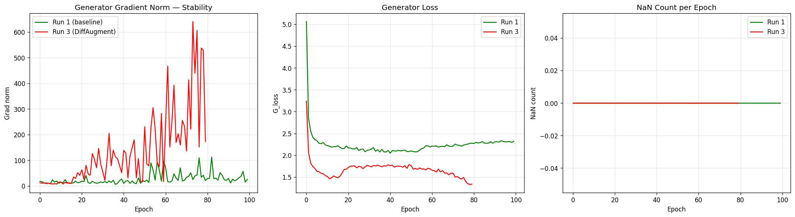

*Top: Tejas's FID per snapshot in the final run, and best FID across his five runs. Bottom: Shriram's run-1 losses and gradient norm, and his run 1 vs. run 3 stability comparison.*

### Example translations

Tejas (i270k, EMA snapshot epoch 280), input and output pairs. Left: Photo to Monet. Right: Monet to Photo.

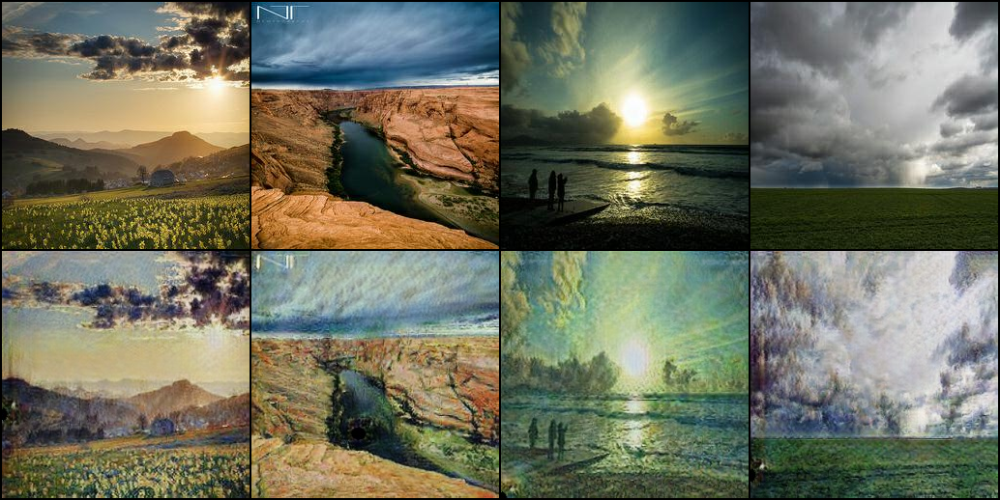
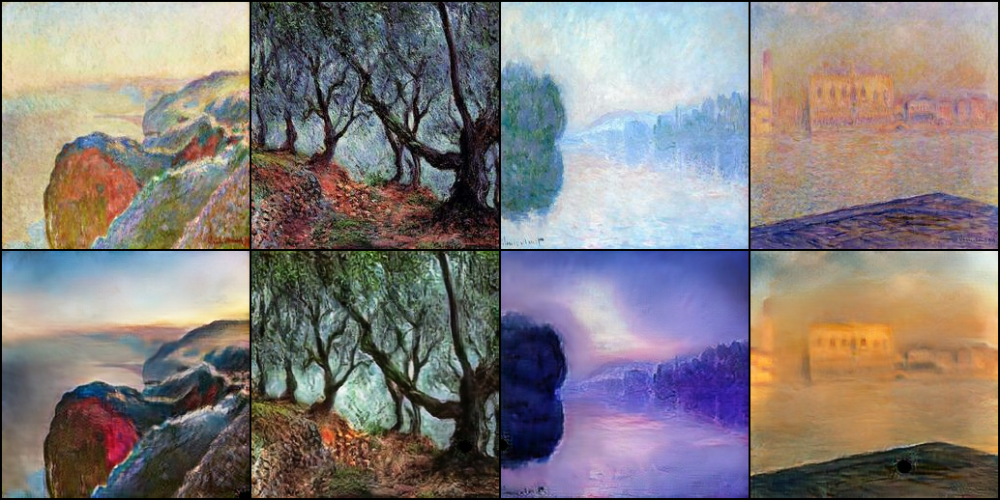

Shriram (run 1, epoch 61), unedited generator outputs from `outputs/pred_B2A/` and `outputs/pred_A2B/`. Top row: Photo to Monet. Bottom row: Monet to Photo.

Cycle-consistency check. Tejas's A→B→A reconstructions are shown below (cycle L1 0.0785 / 0.0849). Shriram checked cycle consistency numerically only (cycle L1 0.0471 / 0.0493).

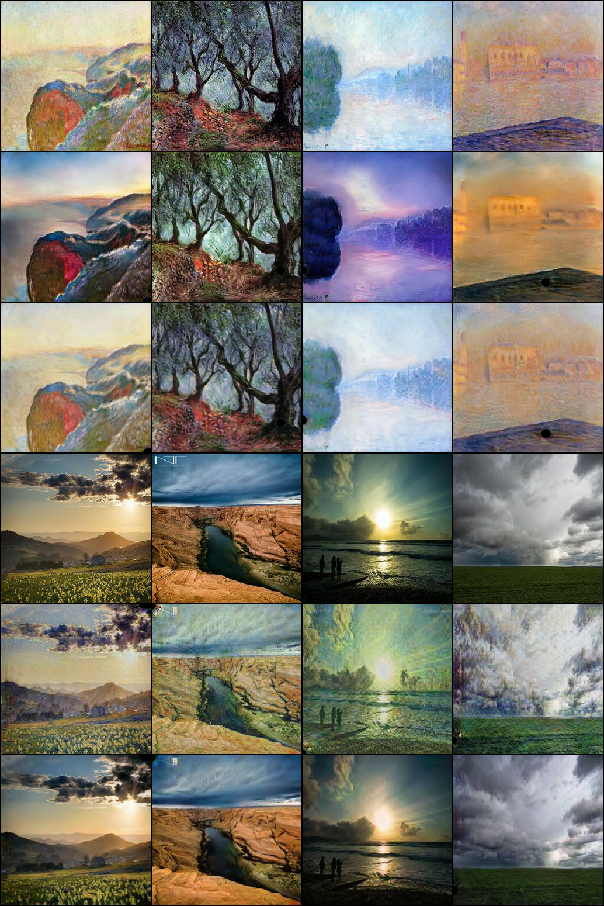

### Joint analysis

**ResNet vs. U-Net.** Tejas's ResNet-9 (28.3M parameters) has lower FID than Shriram's U-Net (114.3M) in both directions: 100.92 vs. 103.92 for A2B and 96.49 vs. 98.95 for B2A. It also changes the input more (LPIPS 0.322 / 0.364 vs. 0.181 / 0.250).

The U-Net reconstructs better through the cycle (L1 0.047 / 0.049 vs. 0.078 / 0.085), which fits Shriram's view that skip connections make reconstruction easy but resist the repainting that stylisation needs. The comparison is confounded with training length (270K vs. 100K updates), DiffAugment and EMA (Tejas only) and the discriminator LR.

**DiffAugment.** It hurt Shriram's U-Net (FID 101.51 in run 2 to 112.97 in run 3, G gradient-norm mean 137 in run 3 vs. 27 in run 1). His discriminator was not dominating (D loss about 0.26).

In Tejas's e200 run the discriminator was dominating (D loss about 0.06), and adding DiffAugment with a slower D and EMA improved FID from 114.23 to 110.70. Both results fit the rule in `TEAM_PROTOCOL.md`: use DiffAugment only when the discriminator overfits. Tejas changed three things at once, so the share due to DiffAugment alone is not isolated.

**Training length.** Tejas's FID kept improving with longer schedules (110.70 at 90K, 103.09 at 180K, 98.70 at 270K). Shriram's best checkpoint was epoch 61 of 100, so the last 39 epochs did not improve FID even though cycle loss kept falling. For both of us, periodic FID on checkpoints was a better selection signal than training loss.

**Direction.** Both models score better on Photo to Monet. Both show higher precision and lower recall for A2B (Tejas 0.747 / 0.483, Shriram 0.683 / 0.443) and the reverse for B2A (0.543 / 0.720 and 0.500 / 0.730). B2A density is the weakest value for both (0.451 and 0.385). Tejas's identity ramp, which lowers λ_id for Photo to Monet only, moved his B2A FID from about 101 to 96.49.

**Stability.** No run of either member produced NaNs. Tejas's final run has his largest G gradient-norm spike (1,017.9 vs. 190.4 for i180k) with a similar mean (29.5). The raw log places it at step 2,300, which is epoch 3 at 900 iterations per epoch, early in the constant-LR phase. Training continued normally, so it was a transient and not a divergence.

He also observed slow discriminator creep late in training (real/fake 0.62/0.38 to 0.70/0.30). Shriram's run 1 was stable at G about 2.3 and D about 0.26.

**Audit vs. FID.** Only Tejas's outputs have been audited; Shriram's audit is pending at time of writing. The style ratings agree with FID on direction: Photo to Monet was rated 4.57 vs. 4.10 and has the lower FID. Content ratings are high (4.70, κ 1.00, partly a ceiling effect), which matches the low cycle L1.

**Evaluation caveat.** Both members score the images they trained on, as the competition requires, and both selected checkpoints using that FID (Tejas among 30 snapshots, Shriram among 6 checkpoints). The reported FIDs are therefore slightly optimistic. The course "MiFID" is a positional cosine distance without a memorisation threshold, so it is not the Kaggle MiFID.

**Strengths.** Tejas's ResNet-9 has the lower FID in both directions (submitted 98.70, Kaggle score −49.55, team rank 20). Each change in his run history improved FID, from 146.97 for quick30 to 98.70 for i270k. Shriram's U-Net gives the better cycle reconstruction (L1 0.047 / 0.049), and his run 1 was stable. Audited content preservation for Tejas's outputs is high (4.70, κ 1.00).

**Weaknesses.** DiffAugment hurt Shriram's U-Net (FID 101.51 to 112.97). The U-Net also changes the input less (LPIPS 0.181 / 0.250), which fits the view that skip connections resist repainting. Both models are weaker on Monet to Photo, and B2A density is the lowest value for both (0.451 and 0.385). Artifacts appear in 55% of Tejas's audited samples, and his final run had a large transient gradient spike (1,017.9).

**Limitations.** Only 300 Monet images; one seed per run; Shriram's outputs are not yet audited and his training peak memory was not logged; different GPUs.

**Next steps.** Finish the shared blinded audit with both members' outputs, hold out photos to measure generalisation, try R1 or spectral-norm regularisation (Tejas), try a weaker DiffAugment policy under a matched budget (Shriram), and compare ResNet and U-Net generators under the same budget.

### Evidence

| | Tejas | Shriram |
|---|---|---|
| FID per checkpoint | [`fid_vs_epoch.png`](../task3_gan/tejas/outputs/fid_vs_epoch.png), [`checkpoint_selection.csv`](../task3_gan/tejas/outputs/checkpoint_selection.csv), [`experiments_comparison.png`](../task3_gan/tejas/exploratory/i180k/outputs/experiments_comparison.png) | printed in [`task3_cyclegan_unet.ipynb`](../task3_gan/shriram_dundigalla/src/task3_cyclegan_unet.ipynb) (runs 1, 2 and 3) |
| Loss curves | [`loss_curves.png`](../task3_gan/tejas/outputs/loss_curves.png), [`epoch_history.csv`](../task3_gan/tejas/outputs/epoch_history.csv) | [`loss_curves_run1.png`](../task3_gan/shriram_dundigalla/outputs/figures/loss_curves_run1.png), [`run1_vs_run3_stability.png`](../task3_gan/shriram_dundigalla/outputs/figures/run1_vs_run3_stability.png), [`metrics_per_epoch.csv`](../task3_gan/shriram_dundigalla/logs/metrics_per_epoch.csv) |
| Examples | [`examples_photo2monet.png`](../task3_gan/tejas/outputs/examples_photo2monet.png), [`examples_monet2photo.png`](../task3_gan/tejas/outputs/examples_monet2photo.png), [`samples/`](../task3_gan/tejas/outputs/samples/) | [`pred_A2B/`](../task3_gan/shriram_dundigalla/outputs/pred_A2B/) (300), [`pred_B2A/`](../task3_gan/shriram_dundigalla/outputs/pred_B2A/) (7,038) |
| Cycle verification | [`cycle_verification.png`](../task3_gan/tejas/outputs/cycle_verification.png) | numeric check in the notebook |
| Submission | [`submission.csv`](../task3_gan/tejas/submission.csv) (98.7030 / 0.41056) | [`submission.csv`](../task3_gan/shriram_dundigalla/submission.csv) (101.4378 / 0.41722) |
| Course-script cross-check | [`ta_eval_script_executed.ipynb`](../task3_gan/tejas/outputs/ta_eval_script_executed.ipynb), [`submission_ta_script.csv`](../task3_gan/tejas/outputs/submission_ta_script.csv) (98.70296 / 0.41056, agrees with `submission.csv` to < 1e-6) | course script run in the notebook with only paths changed: Photo to Monet FID 98.952, Monet to Photo FID 103.924, matching `submission.csv` |
| Audit | [`audit_results.csv`](../task3_gan/tejas/outputs/audit_results.csv), [`audit_rater1.csv`](../task3_gan/tejas/outputs/audit_rater1.csv), [`audit_rater2.csv`](../task3_gan/tejas/outputs/audit_rater2.csv), [`audit/`](../task3_gan/tejas/outputs/audit/) | [`human_audit/`](../task3_gan/human_audit/) (pending) |
| Raw logs | [`t3_cyclegan_tejas_20261002-132424.jsonl`](../reproducibility/raw_logs/task3_gan/tejas/t3_cyclegan_tejas_20261002-132424.jsonl) and one per exploratory run | [`task3_cyclegan_unet_run1.log`](../reproducibility/raw_logs/task3_cyclegan_unet_run1.log), [`train.log`](../task3_gan/shriram_dundigalla/logs/train.log) |
| Weights | `checkpoints/G_AB.pt`, `G_BA.pt` (EMA, committed) | `ckpt_epoch060.pth` (1.3 GB, not in git; SHA-256 in [`checkpoints/README.md`](../task3_gan/shriram_dundigalla/checkpoints/README.md)) |

---

## Failure and error analysis

### Task 1: three failure cases per member

**Tejas** (`task1_llm/tejas/failure_analysis.md`; 300 new characters per prompt):

| Case | Decoding / prompt | Snippet (verbatim) | Failure type | Observation |
|---|---|---|---|---|
| 1 | Greedy, "One day, Tom" (repeated 4-gram rate 0.213) | "One day, Tom wanted to play with his toys and run around outside. He saw a big tree with many leaves. Tom wanted to climb the tree, but he was too small. He tried to climb the tree, but he could not. Tom was sad. Tom saw a big tree…" | Repetition loop | The plot stalls and restarts the same scene; argmax reinforces frequent phrases. |
| 2 | Greedy, "The little dog" | "The little dog was so happy to have a new friend. They played together all day long. The end. / Once upon a time, there was a little girl named Lily. She loved to play outside in the sunshine. One day, she saw a big box in the garden." | Story reset | After "The end." the model falls back to the most common opening, identical to the greedy "Once upon a time" output. The 300-character generation is longer than the 256-character context. |
| 3 | T = 0.8, "In the forest" | "In the forest was a bright, sunny barn. The barn was full of lots of animals, flowers and flowers. At night, the barn went for many long walks in the meadow. But then, something bad happened. A man came to say he had a spell." | Semantic error | Grammatical but impossible: a barn "went for many long walks". Good local syntax, weak world knowledge. |

**Shriram** (`task1_llm/shriram_dundigalla/failure_analysis.md`; prompt "Once upon a time", 400 new characters):

| Case | Temperature | Snippet (verbatim) | Failure type | Observation |
|---|---|---|---|---|
| 1 | 0.0 (greedy) | "…She saw a big box of stars and a big box. She wanted to see what was inside. She wanted to see what was inside. She took a big bite and started to cry." | Verbatim repetition | Repeated 4-gram rate 0.060 at T = 0 vs. 0.000 at T ≥ 0.5 in this draw; a decoding failure. |
| 2 | 0.8 | "One day, Timmy wanted to go to the park, so he asked his mommy if he could have him playing. His mommy bought the nuts and said hello. Timmy remembered his mommy tost his toys and she asked him what he was wrong." | Broken grammar and a non-word | "tost" is not a word; distinct-n still scores the passage as perfect, which led him to add a training-vocabulary word rate (0.988). |
| 3 | 1.0 | "Once upon a time, there was a little boy named Benny. Benny loved his car and rolled his doll's teeth. … They were talking to the park to play them with it. / Once upon a time, there was a little boy named Timmy." | Loss of coherence, early story boundary | Benny leaves the 128-character window and the model starts a new story mid-generation. |

Both members found the same two mechanisms: greedy looping, and story resets caused by the context window and the story separator. This supports both proposed fixes, a repetition penalty (already shown to work by Shriram) and a longer context.

### Task 2: 20-error reviews

Both members reviewed 5 confident false positives, 5 confident false negatives, 5 near-threshold errors and 5 weakest-slice errors.

**Tejas**, BiGRU with attention, weakest slice `truncated = True` (`task2_sentiment/tejas/failure_analysis.md`, `outputs/error_candidates.csv`):

| Error type | Count |
|---|---|
| Truncation / long narrative | 5 |
| Contrast, mixed, lukewarm or comparative | 6 |
| Sarcasm / irony | 2 |
| Edited reviews (temporal mismatch) | 2 |
| Label noise / rating and text mismatch | 2 |
| Domain vocabulary, implicit sentiment, tokenization | 3 |

Examples:

- **FN4** (p = 0.001, sarcasm): "TERRIBLE SERVICE, RUDE WAITERS WITH A PISS POOR ATTITUDE! WOULD EAT HERE AGAIN! A++++". Lowercasing and punctuation removal remove the cues.
- **FP5** (p = 0.999, comparative): "Though I'm a Copper enthusiast… Maharani was a cheaper but tasty option… Copper is definitely still my place, but Maharani was fine enough." The praise is for a competitor.
- **NT3** (p = 0.498, contrast and tokenization): "…deserve 5 starshowever the procedures used to estimate and charge… are in need of improvement." The missing space merges two informative words into one unknown token.

**Proposed fix (Tejas).** Raise max_len from 188 to 400 tokens (about the 99th percentile), keep head and tail truncation, and retrain Exp 2 with the same seed. Measure the error rate and macro-F1 on the truncated slice before and after, run a paired McNemar test on the full test set, and record training time and peak memory.

**Shriram**, TextCNN, 2,492 errors (6.56%), weakest slice `exclamations = no_exclaim` (`task2_sentiment/shriram_dundigalla/failure_analysis.md`, `outputs/error_review_exp2_textcnn.csv`):

| Error type | Count |
|---|---|
| Negation scope / detached negation | 3 |
| Temporal contrast (past negative, present positive) | 2 |
| Genuinely mixed sentiment (near threshold) | 5 |
| Probable label noise | 2 |
| Late verdict reversal / concessive | 2 |
| Sarcasm | 1 |
| Target confusion | 1 |
| Truncation | 1 |
| Rhetorical question | 1 |
| Insufficient evidence (very short) | 2 |

Examples:

- **A1** (p = 0.9994, sarcasm): "Yay. Cafeteria food. Yay."
- **A2** (p = 0.9991, late verdict reversal): "We had a great time and I thoroughly enjoyed the food, but I need to give this a 1 start given that if we had eaten a week later, this salmonella outbreak could have caused immeasurable harm to our child."
- **B3** (p = 0.0006, target confusion): "Someone deleted my review.. intentionally. That is very rude and disrespectful. Don't be silly guys.. I like this place and new owner is very nice and friendly…"

**Proposed fixes (Shriram).** His first priority is position-aware pooling: add a max-pool over the last 20% of tokens to the global max-pool, and check that accuracy improves on "but"/"however" reviews while overall accuracy holds. He also proposes negation-scope marking (a `NOT_` prefix on the 3 tokens after a negation) and hand-labelling the 200 most confident errors to estimate the label-noise ceiling.

Both reviews conclude that part of the remaining error cannot be fixed by modelling. Shriram counts 8 of 20 (sarcasm, label noise, mixed reviews). Tejas counts 4 of 20 as unfixable (edited reviews, label noise) and 2 as hard (sarcasm).

### Task 3: failure cases

**Tejas** (`task3_gan/tejas/failure_analysis.md`):

| Case | Failure type | Evidence file | What changed or would fix it |
|---|---|---|---|
| quick30 | Checkerboard texture and dark blobs (FID 146.97) | `exploratory/quick30/outputs/examples_monet2photo.png` | Resize-convolution in e200 (FID 114.23) |
| e200 | Discriminator domination (D loss 0.057 / 0.061, D_A real/fake 0.863 / 0.134 at epoch 200) | `exploratory/e200/outputs/epoch_history.csv` | DiffAugment, D LR 1e-4 and EMA in e300 (FID 110.70) |
| e300 | FID plateau (110.70 to 111.99) caused by the LR reaching zero | `exploratory/e300/outputs/checkpoint_selection.csv` | Schedule twice as long in i180k (FID 103.09) |
| i180k | Photo to Monet stuck near 101 while Monet to Photo improved | `exploratory/i180k/outputs/checkpoint_selection.csv` | Direction-specific identity ramp in i270k (B2A 96.49) |
| i270k | Sky speckle and washed-out sun (artifacts in 55% of audited samples); slow D_A creep | `outputs/examples_photo2monet.png`, `outputs/audit_results.csv` | R1 or spectral norm, lower identity weight (proposed, not tested) |

**Shriram** (`task3_gan/shriram_dundigalla/failure_analysis.md`):

| Case | Failure type | Evidence file | What changed or would fix it |
|---|---|---|---|
| Run 3 | DiffAugment made FID worse (101.44 to 112.97; G gradient-norm mean 27.0 to 137.0) | `full_metrics_report.csv` | Use DiffAugment only when the discriminator overfits; run 1 D loss stayed near 0.26 |
| Run 2 | Loss-weight tuning changed almost nothing (101.44 to 101.51) | `full_metrics_report.csv` | Bottleneck is likely the architecture or the amount of Monet data, not the lambda values |
| Run 1 | Best checkpoint at epoch 61, not 100, while cycle loss kept falling | `logs/metrics_per_epoch.csv` | Select checkpoints with periodic FID, not training loss |
| Run 1 | Photo to Monet density 0.3847 (weakest value); skip connections resist repainting | `full_metrics_report.csv` | Points to a limitation of the U-Net choice |

Both members found that DiffAugment helps only when the discriminator is dominating: it helped Tejas's e200 setup and hurt Shriram's balanced run. Both also found Photo to Monet harder to fix: Tejas's i180k run stalled in that direction, and Shriram's weakest value (density 0.3847) is in that direction.

---

## Reproducibility

**Smoke tests.** `README.md` gives a one-command smoke test for Tejas's notebooks: `cd task3_gan/tejas/src && SMOKE=1 jupyter nbconvert --to notebook --execute --output smoke_run.ipynb task3_cyclegan.ipynb`, with the same pattern for Tasks 1 and 2.

Shriram's scripts take a `--smoke` flag that writes only to gitignored `smoke/` folders: `python task1_llm/shriram_dundigalla/src/train.py --smoke --require-cuda` and `python task2_sentiment/shriram_dundigalla/src/train.py --smoke --require-cuda`. His Task 3 notebook has its own one-epoch smoke cell. Repository-wide checks are `python scripts/verify_gpu_ready.py` and `python scripts/verify_submission.py`.

**Configuration.** Tejas uses a `CFG` cell in each notebook, recorded in each manifest JSON. Shriram uses YAML configs (`task1_llm/shriram_dundigalla/src/config*.yaml`, `task2_sentiment/shriram_dundigalla/src/config.yaml`, `task3_gan/shriram_dundigalla/src/config.yaml`).

**Raw logs and manifests.**

| Member | Raw logs | Manifests |
|---|---|---|
| Tejas | `reproducibility/raw_logs/{task1_llm,task2_sentiment,task3_gan}/tejas/` (Task 3: final run and four exploratory runs) | `reproducibility/manifests/{task1_llm,task2_sentiment,task3_gan}/tejas/` (JSON and `requirements_frozen.txt`) |
| Shriram | `reproducibility/raw_logs/` (`task1_gpt_char_*.log`, `task2_*.log`, `task3_cyclegan_unet_run1.log`, smoke logs) | `reproducibility/manifests/shriram_dundigalla_manifest.md` |

**Data and weights.** The datasets were provided by the instructor and are not stored in git. They can be downloaded from [Google Drive](https://drive.google.com/file/d/1eskFxGtgXGmmXbfpCfRt5k69GIKQ-_a3/view?usp=sharing); `README.md` gives the expected folder layout. Shriram's Task 3 checkpoint (1.3 GB) is not in git; its SHA-256 is in `task3_gan/shriram_dundigalla/checkpoints/README.md`.

**Absolute paths in logs and manifests.** Raw logs and manifests are kept unedited, so they contain the runtime paths of the machines that produced them (a Windows PC and Google Colab). This is disclosed in `README.md`. Tejas's notebook outputs use `<REPO>` placeholders. Shriram's Task 3 notebook keeps its Colab Drive paths, so running it elsewhere requires changing the Drive root in its first cell.

---

## References

1. Vaswani, A., Shazeer, N., Parmar, N., Uszkoreit, J., Jones, L., Gomez, A. N., Kaiser, Ł., & Polosukhin, I. (2017). Attention Is All You Need. *NeurIPS 2017*.
2. Eldan, R., & Li, Y. (2023). TinyStories: How Small Can Language Models Be and Still Speak Coherent English? *arXiv:2305.07759*.
3. Zhu, J.-Y., Park, T., Isola, P., & Efros, A. A. (2017). Unpaired Image-to-Image Translation using Cycle-Consistent Adversarial Networks. *ICCV 2017*.
4. Zhao, S., Liu, Z., Lin, J., Zhu, J.-Y., & Han, S. (2020). Differentiable Augmentation for Data-Efficient GAN Training. *NeurIPS 2020*.
5. Joulin, A., Grave, E., Bojanowski, P., & Mikolov, T. (2017). Bag of Tricks for Efficient Text Classification. *EACL 2017*.
6. Zhang, X., Zhao, J., & LeCun, Y. (2015). Character-level Convolutional Networks for Text Classification. *NeurIPS 2015*.
7. Johnson, J., Alahi, A., & Fei-Fei, L. (2016). Perceptual Losses for Real-Time Style Transfer and Super-Resolution. *ECCV 2016*.
8. Guo, C., Pleiss, G., Sun, Y., & Weinberger, K. Q. (2017). On Calibration of Modern Neural Networks. *ICML 2017*.
9. Heusel, M., Ramsauer, H., Unterthiner, T., Nessler, B., & Hochreiter, S. (2017). GANs Trained by a Two Time-Scale Update Rule Converge to a Local Nash Equilibrium. *NeurIPS 2017*.
10. Bińkowski, M., Sutherland, D. J., Arbel, M., & Gretton, A. (2018). Demystifying MMD GANs. *ICLR 2018*.
11. Zhang, R., Isola, P., Efros, A. A., Shechtman, E., & Wang, O. (2018). The Unreasonable Effectiveness of Deep Features as a Perceptual Metric. *CVPR 2018*.
12. Naeem, M. F., Oh, S. J., Uh, Y., Choi, Y., & Yoo, J. (2020). Reliable Fidelity and Diversity Metrics for Generative Models. *ICML 2020*.
13. Isola, P., Zhu, J.-Y., Zhou, T., & Efros, A. A. (2017). Image-to-Image Translation with Conditional Adversarial Networks. *CVPR 2017*.
14. Mao, X., Li, Q., Xie, H., Lau, R. Y. K., Wang, Z., & Smolley, S. P. (2017). Least Squares Generative Adversarial Networks. *ICCV 2017*.
15. Ronneberger, O., Fischer, P., & Brox, T. (2015). U-Net: Convolutional Networks for Biomedical Image Segmentation. *MICCAI 2015*.
16. Odena, A., Dumoulin, V., & Olah, C. (2016). Deconvolution and Checkerboard Artifacts. *Distill*.
17. Holtzman, A., Buys, J., Du, L., Forbes, M., & Choi, Y. (2020). The Curious Case of Neural Text Degeneration. *ICLR 2020*.
18. Keskar, N. S., McCann, B., Varshney, L. R., Xiong, C., & Socher, R. (2019). CTRL: A Conditional Transformer Language Model for Controllable Generation. *arXiv:1909.05858*.
19. Kim, Y. (2014). Convolutional Neural Networks for Sentence Classification. *EMNLP 2014*.
20. Hochreiter, S., & Schmidhuber, J. (1997). Long Short-Term Memory. *Neural Computation, 9*(8).
21. Cho, K., van Merriënboer, B., Gulcehre, C., Bahdanau, D., Bougares, F., Schwenk, H., & Bengio, Y. (2014). Learning Phrase Representations using RNN Encoder-Decoder for Statistical Machine Translation. *EMNLP 2014*.
