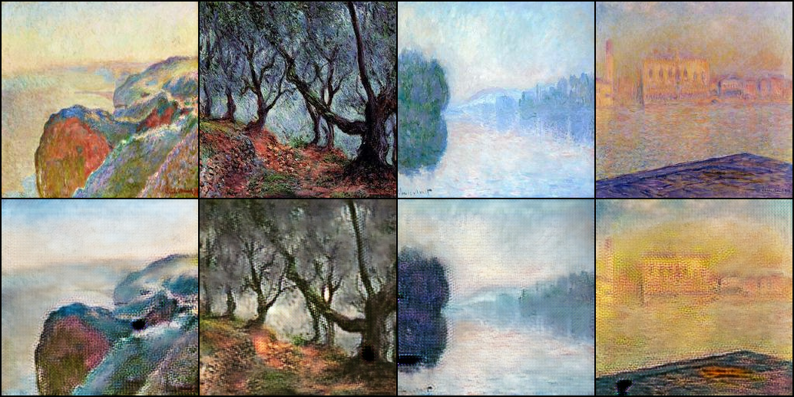
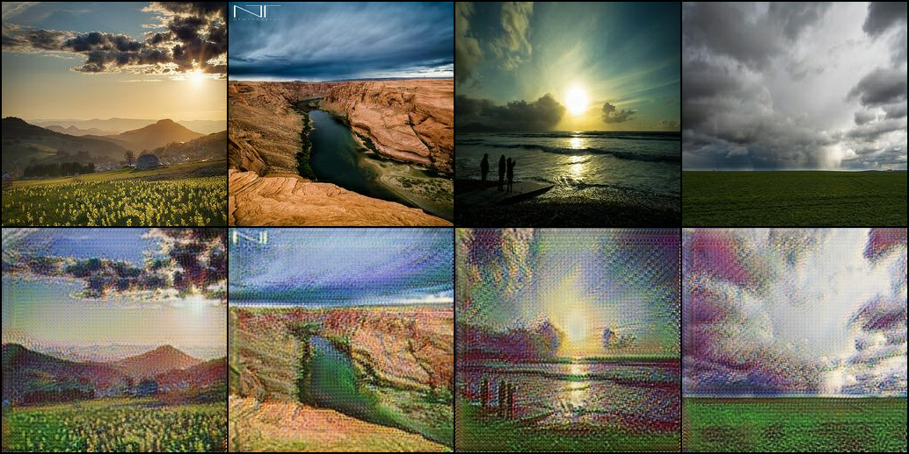

# Task 3 failure analysis: CycleGAN Monet and Photo (Tejas)

This file lists the main failures and shortcomings I found across my five Task 3 runs, in the order I hit them. Each case gives what I observed, the evidence, the likely cause and what I changed (or what would fix it). A2B is Monet to Photo and B2A is Photo to Monet. FID values use the course formula (n = 300 per side) and are taken from each run's `checkpoint_selection.csv` or from `results.md`. Epochs are 1-based.

## Case 1: quick30, checkerboard texture and dark blobs

**Observed.** The 9K-iteration baseline reached a best FID of 146.97 (A2B 142.8 / B2A 151.1) (`results.md`). In the Monet to Photo examples, the outputs (bottom row) have a fine grid texture across flat areas such as sky and water. Some outputs also have dark blob artifacts, for example on the rock in the first column.

**Evidence.** [`exploratory/quick30/outputs/examples_monet2photo.png`](exploratory/quick30/outputs/examples_monet2photo.png)

**Likely cause.** The paper configuration upsamples with transposed convolutions. When the kernel size is not divisible by the stride, the kernels overlap unevenly and leave a periodic checkerboard pattern (Odena et al., 2016). The run was also very short, so the blobs may partly be undertraining.

**What I changed.** In e200 I replaced both transposed convolutions with resize-convolution (nearest upsampling followed by a convolution) and trained longer with snapshot selection. The best FID improved to 114.23 (A2B 122.3 / B2A 106.2).

## Case 2: e200, discriminator domination

**Observed.** Over the 200 epochs (60K iterations), the discriminators slowly took over (`exploratory/e200/outputs/epoch_history.csv`):

| Epoch | D_A loss | D_B loss | D_A real / fake | D_B real / fake | Generator adversarial loss |
|---|---|---|---|---|---|
| 10 | 0.177 | 0.218 | 0.736 / 0.269 | 0.644 / 0.354 | 0.987 |
| 100 | 0.137 | 0.136 | 0.762 / 0.238 | 0.762 / 0.238 | 1.165 |
| 150 | 0.079 | 0.082 | 0.847 / 0.153 | 0.840 / 0.162 | 1.382 |
| 200 | 0.057 | 0.061 | 0.863 / 0.134 | 0.855 / 0.142 | 1.531 |

FID stopped improving in step with this. The best snapshot was epoch 180 (114.23), and epoch 200 was worse (115.66) (`exploratory/e200/outputs/checkpoint_selection.csv`).

**Evidence.** [`exploratory/e200/outputs/epoch_history.csv`](exploratory/e200/outputs/epoch_history.csv), [`exploratory/e200/outputs/loss_curves.png`](exploratory/e200/outputs/loss_curves.png)

**Likely cause.** There are only 300 Monet images, so the discriminator can memorise the real set. Once it separates real from fake with high confidence (about 0.86 / 0.14), its gradients give the generator less useful direction, and the generator's adversarial loss rises.

**What I changed.** In e300 I added DiffAugment (colour, translation, cutout) on every discriminator input, lowered the discriminator LR to 1e-4 and added an EMA of the generator weights. From epoch 100 to 300, D losses stayed between 0.18 and 0.22 and D real/fake stayed between about 0.61 / 0.39 and 0.63 / 0.37 (`exploratory/e300/outputs/epoch_history.csv`). The best FID improved to 110.70. I changed three things at once, so I cannot say how much DiffAugment contributed alone.

## Case 3: e300, an apparent FID plateau that was the LR reaching zero

**Observed.** e300's FID flattened at the end: 110.70 at epoch 260, 111.09 at epoch 280 and 111.99 at epoch 300 (`exploratory/e300/outputs/checkpoint_selection.csv`). It looked like the model had hit a capacity limit.

| Epoch (e300) | Learning rate | FID mean |
|---|---|---|
| 200 | 1.35e-4 | 114.74 |
| 260 | 5.47e-5 | 110.70 |
| 280 | 2.80e-5 | 111.09 |
| 300 | 1.33e-6 | 111.99 |

**Evidence.** [`exploratory/e300/outputs/checkpoint_selection.csv`](exploratory/e300/outputs/checkpoint_selection.csv), [`exploratory/e300/outputs/epoch_history.csv`](exploratory/e300/outputs/epoch_history.csv), [`exploratory/i180k/outputs/checkpoint_selection.csv`](exploratory/i180k/outputs/checkpoint_selection.csv)

**Likely cause.** The linear decay brought the LR close to zero, so the last epochs could barely move the weights. The plateau was a property of the schedule, not of the model.

**What I changed.** i180k used the same setup but a schedule twice as long (900 iterations per epoch). At epoch 100 (90K iterations, LR still at the 2e-4 peak) it already scored 110.24, about the same as e300's best. It then kept improving during its own decay, to 103.09 at epoch 200 (180K iterations). The extra iterations gave a lower FID, so the e300 result was not a capacity limit.

## Case 4: i180k, Photo to Monet stuck near 101

**Observed.** Late in i180k, the two directions behaved differently (`exploratory/i180k/outputs/checkpoint_selection.csv`):

| Epoch (i180k) | FID A2B (Monet to Photo) | FID B2A (Photo to Monet) |
|---|---|---|
| 140 | 109.81 | 101.97 |
| 160 | 108.12 | 101.13 |
| 180 | 105.24 | 101.48 |
| 200 | 104.70 | 101.48 |

Monet to Photo improved by about 5 points over these snapshots, while Photo to Monet stayed between 101.1 and 102.0.

**Evidence.** [`exploratory/i180k/outputs/checkpoint_selection.csv`](exploratory/i180k/outputs/checkpoint_selection.csv), [`exploratory/i180k/outputs/experiments_comparison.png`](exploratory/i180k/outputs/experiments_comparison.png)

**Likely cause.** The identity loss (λ_id = 5) rewards the Photo to Monet generator for leaving its input unchanged. That pulls against the strong repainting the Monet style needs, so this direction was held back more than Monet to Photo.

**What I changed.** In i270k I kept λ_id = 5 for Monet to Photo and ramped the Photo to Monet identity weight linearly from 5 to 1.5 during the decay phase. I also lowered the discriminator LR to 7.5e-5 and used a 45/55 constant/decay schedule. The final B2A FID dropped to 96.49 at epoch 280, below the ~101 plateau, and the submitted mean FID was 98.70 (`outputs/checkpoint_selection.csv`, `submission.csv`). The schedule also changed, so the ramp is the likely cause of the B2A gain, but it is not isolated.

## Case 5: i270k (final), remaining artifacts and slow discriminator creep

**Observed, artifacts.** In the Photo to Monet examples, bright skies get high-frequency speckle (most visible in the stormy sky, last column), and the area around the sun is washed out into a flat bright patch (third column). The blinded human audit found visible artifacts in 55% of the 30 samples (53% A2B / 57% B2A), with 83% rater agreement and κ = 0.66 (`outputs/audit_results.csv`).

**Observed, discriminator creep.** D_A (the Monet discriminator) slowly gained an advantage over the run, while D_B stayed flat (`outputs/epoch_history.csv`):

| Epoch | D_A real / fake | D_A loss | D_B real / fake | D_B loss |
|---|---|---|---|---|
| 50 | 0.617 / 0.382 | 0.206 | 0.617 / 0.382 | 0.205 |
| 135 | 0.664 / 0.337 | 0.179 | 0.631 / 0.368 | 0.195 |
| 280 | 0.706 / 0.295 | 0.145 | 0.624 / 0.375 | 0.188 |
| 300 | 0.701 / 0.300 | 0.144 | 0.627 / 0.379 | 0.184 |

This is much slower than e200 (0.86 / 0.14 within 60K iterations), and FID did not get worse: epochs 270 to 300 all scored 98.7 to 99.2 (`results.md`).

**Evidence.** [`outputs/examples_photo2monet.png`](outputs/examples_photo2monet.png), [`outputs/audit_results.csv`](outputs/audit_results.csv), [`outputs/epoch_history.csv`](outputs/epoch_history.csv), [`outputs/loss_curves.png`](outputs/loss_curves.png)

**Likely cause.** Bright, nearly flat regions give the generator little texture to work with, so it adds brush-stroke-like noise everywhere. Very bright pixels are also hard to reconstruct through the cycle, which favours a flat bright output. The D_A creep comes from the same small Monet set as in Case 2: DiffAugment and the slower D slow down memorisation but do not stop it.

**What would fix it (not yet tested).** Stronger discriminator regularisation (R1 gradient penalty or spectral norm) for the creep. For the artifacts, a lower Photo to Monet identity weight or a perceptual term could help, and the effect could be measured with a follow-up audit of the same 30 samples. A held-out photo set would show whether these artifacts also appear on unseen images.

## Summary

| Run | Failure | Key number | Evidence | Change or fix | Result |
|---|---|---|---|---|---|
| quick30 | Checkerboard texture, dark blobs | FID 146.97 | `exploratory/quick30/outputs/examples_monet2photo.png` | Resize-convolution (e200) | FID 114.23 |
| e200 | Discriminator domination | D loss 0.057 / 0.061, D_A real/fake 0.863 / 0.134 at epoch 200 | `exploratory/e200/outputs/epoch_history.csv` | DiffAugment, D LR 1e-4, EMA (e300) | FID 110.70 |
| e300 | Plateau caused by LR reaching zero | 110.70 to 111.99 while LR fell to 1.33e-6 | `exploratory/e300/outputs/checkpoint_selection.csv` | Schedule twice as long (i180k) | FID 103.09 |
| i180k | Photo to Monet stuck near 101 | B2A 101.97 to 101.48; A2B 109.81 to 104.70 | `exploratory/i180k/outputs/checkpoint_selection.csv` | Direction-specific identity ramp (i270k) | B2A 96.49, mean 98.70 |
| i270k | Sky speckle, washed-out sun, slow D_A creep | artifacts in 55% of audited samples; D_A 0.617 / 0.382 to 0.706 / 0.295 | `outputs/examples_photo2monet.png`, `outputs/audit_results.csv`, `outputs/epoch_history.csv` | R1 or spectral norm, lower identity weight (proposed) | not yet tested |
